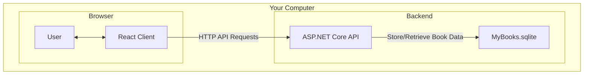

# 📚 React MyBooks

**React MyBooks** is a fully self-contained book management application that lets you organize and manage your personal book collection locally. No data ever leaves your machine.

It features a clean, modern React frontend built with Vite and styled with Tailwind CSS, plus a robust ASP.NET Core backend powered by Entity Framework Core for data management.


## ✨ Core Features

*   **100% Local & Offline**: Your book collection data never touches the internet.
*   **Book Management**: Add, edit, and organize your personal book collection.
*   **Author Management**: Manage authors with support for books having multiple authors.
*   **Category Organization**: Organize books into multiple categories for easy browsing.
*   **Relationship Support**: Full support for many-to-many relationships between books and authors, books and categories.
*   **Modern Web UI**: A responsive and intuitive interface built with React, Vite, and Tailwind CSS.
*   **Persistent Storage**: Uses EF Core and a local SQLite database to store all your book data.

## 🏛️ Architecture

The project is architected with a clean separation between the frontend client and the backend API, enabling scalability and maintainability.



## 🛠️ Technology Stack

| Area | Technology | Purpose |
| :--- | :--- | :--- |
| **Frontend** | React + Vite | Rich, interactive JavaScript-based web UI with fast development. |
| | Tailwind CSS | Utility-first CSS framework for rapid UI development. |
| **Backend** | ASP.NET Core 9 Web API | High-performance API for handling business logic. |
| | C# 12 | Modern, powerful language for the backend. |
| **Database** | Entity Framework Core 8 | ORM for interacting with the database. |
| | SQLite | Lightweight, serverless, file-based database for local storage. |


## ✅ Prerequisites

Before you begin, ensure you have the following installed:

1.  **.NET 9 SDK**: [Download here](https://dotnet.microsoft.com/download/dotnet/9.0)
2.  **Node.js and npm**: [Download here](https://nodejs.org/) (Required for React, Vite, and Tailwind CSS)

## ⚙️ Setup and Running Instructions

Follow these steps to get the application running locally.

### 1. Clone the Repository

```bash
git clone https://github.com/donpotts/ReactMyBooks.git
cd MyBooks
```

### 2. Run the Backend Server (`MyBooks`)

The backend must be running before you start the frontend.

```bash
# Navigate to the server project directory
cd MyBooks

# Restore dependencies
dotnet restore

# Apply database migrations. This creates and seeds the MyBooks.sqlite file.
dotnet ef database update

# Run the server
dotnet run
```
The API will now be running, typically at `https://localhost:7216`.

### 3. Run the Frontend Client (`ReactModernClient`)

Open a **new terminal window** for this step.

```bash
# Navigate to the client project directory
cd my-books-react

# Install Node.js dependencies for React, Vite, and Tailwind CSS
npm install

# Run the Vite development server
npm run dev
```
Your default browser should open to the application, typically at `http://localhost:5173`.

## 📖 How to Use

1.  **Launch the App**: Once the client and server are running, the web UI will load.
2.  **Browse Books**: The main interface will show your book collection. Books can be filtered by author or category.
3.  **Add New Books**: Use the "Add Book" button to create new book entries with multiple authors and categories.
4.  **Manage Authors**: Add and manage authors who can be associated with multiple books.
5.  **Organize Categories**: Create categories to organize your books by genre, topic, or any classification system you prefer.
6.  **Edit Relationships**: Easily modify the relationships between books, authors, and categories as your collection grows.

## 📂 Project Structure

The solution is organized into three distinct projects for a clean separation of concerns:

```
/
├── ReactModernClient/  # The React + Vite frontend project and all UI components.
├── MyBooks/            # The ASP.NET Core Web API, services, data models, and database logic.
└── MyBooks.Shared/     # A class library for DTOs shared between the client and server.
```

---

**NOTE: This project is designed to run entirely on your local machine for complete privacy and control of your personal book collection data. It does not require any cloud services or external APIs.**

## 📞 Contact

For any questions, feedback, or inquiries, please feel free to reach out.

**Don Potts** - [Don.Potts@DonPotts.com](mailto:Don.Potts@DonPotts.com)